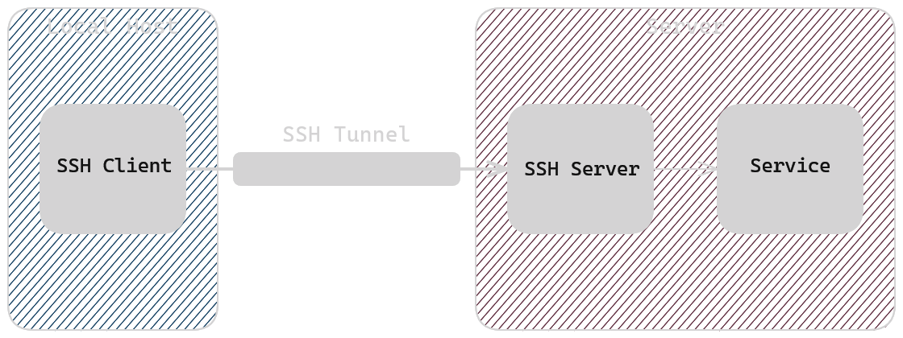
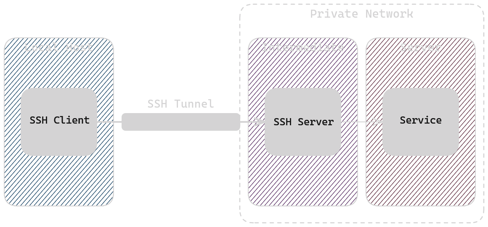
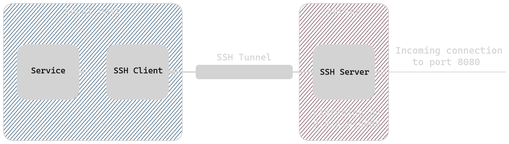
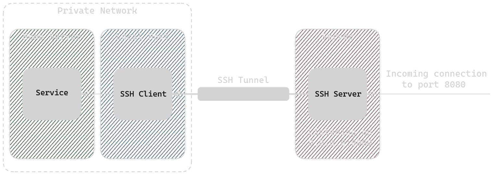

## Local Port Forwarding

Local port forwarding is the method that is used most commonly. It involves the SSH client listening on a port on your local machine and forwarding all traffic to a port on the remote machine you SSH-ed in to.

The syntax for local port forwarding is:

```bash
ssh -L [local_address:]local_port:remote_address:remote_port [user@]ssh_address
```

Say that you have a service running on a remote server that listens on `localhost:80`. Because the service is listening on `localhost`, you can't connect to it directly from our machine. You can, however, forward a port on your machine through an SSH tunnel to access the service.

```bash
ssh -L 8080:localhost:80 user@server
```


This tells SSH to forward all traffic from port 8080 on the local machine to `localhost:80` on the server which will allow you to connect to that service that is listening on localhost. One thing of note is that in the command above, the local address is omitted. Typically this means that the SSH client will listen on `localhost`, but that does depend on the [`GatewayPorts` setting in your SSH config](https://linux.die.net/man/5/sshd_config).



## Local Port Forwarding Through an Intermediate Host

Sometimes you may need to can't SSH directly to a server that's hosting a service and instead need to use some sort of intermediate host to reach the server (jump host, bastion host, etc.). This is possible to do when port forwarding over SSH. In this case, lets say that we have **a local machine, an intermediate host, and a remote server** where we need to connect through the intermediate host and the remote server is what is hosting the service.

If the service is reachable by the intermediate host (e.g. intermediate and server are in a private network where the service is exposed to machines in the network but only the intermediate host is exposed to the internet), then we can achieve this using the following command:

```bash
ssh -L 8080:server:80 user@intermediate
```

This will listen for traffic on port 8080 on the local machine, forward it to the intermediate host, and then send the traffic to `server:80` from the intermediate host.



If the service is not directly reachable from the intermediate host (e.g. it's only listening on localhost on the remote server) then you can port forward twice to get the connection through: first from the local machine to the intermediate host, and then from the intermediate host to the remote server.

```bash
# On the local machine
ssh -L 8080:localhost:9090 user@intermediate
# On the intermediate host
ssh -L 9090:localhost:80 user@remote
```

The first command will forward port 8080 on the local machine to 9090 on the intermediate machine. The second command will then forward 9090 on the intermediate machine to port 80 on the remote server. When these commands are run together, it helps to create a path for the connection to get forwarded all the way to the remote server.


## Remote Port Forwarding

Sometimes you may need to expose a service that's running locally to some external server. The syntax for remote port forwarding is:

```bash
ssh -R [remote_address:]remote_port:local_address:local_port [user@]server
```

This will take traffic from the remote port on the server and forward it to your local address and port. One caveat here is that, by default, you will only be allowed to use the server's localhost as the remote address. If you want to expose the port on all interfaces, you would need to update the SSH config on the server and set `GatewayPorts` to `yes` or `clientspecified`.

If `GatewayPorts` is enabled, you could do the following to forward all traffic on port 8080 on the server to port 80 on my local machine:

```bash
ssh -R 0.0.0.0:8080:localhost:80 user@server
```



## Remote Port Forwarding Through an Intermediate Host

You could also use your local machine as an intermediate host to allow access to a private network or something similar by forwarding traffic to another host on the network. The following command could be used to forward traffic from a remote server to a home server on your private network using your local machine as a jump host:

```bash
ssh -R 0.0.0.0:8080:home-server:80 user@remote-server
```



## Forwarding in the Background

If you just pass the `-L` or `-R` flags to `ssh`, it will open a normal SSH session while also forwarding the ports. This, however, is typically not what people want. If you are running the command only to forward a port, you can pass the `-N` flag to signal `ssh` to not execute any commands. This will cause the SSH command to just forward the port without opening a session, but it will still stay in the foreground of the terminal window.

```bash
ssh -N -L 8080:localhost:80 user@server
```

If you want to run this in the background, you can simply add the `-f` flag as well. This will cause the SSH command to run in the and give you control of the terminal session back.

```bash
ssh -f -N -L 8080:localhost:80 user@server
```

One side effect of this is that you can't just stop the port forwarding by hitting `ctrl+c` or closing the terminal. You will need to manually find the process ID of the SSH process that's running in the background and kill it. You can do this by running `ps -lef`, looking for the `ssh` command and taking note of the PID, and then running `kill {PID}`. If you want a single command to find and kill any `ssh` commands using `-L` or `-R` you can use the following command:

```bash
ps -lef | grep ssh | grep -E "\-L|\-R" | awk '{print $4}' | xargs -t kill
```
